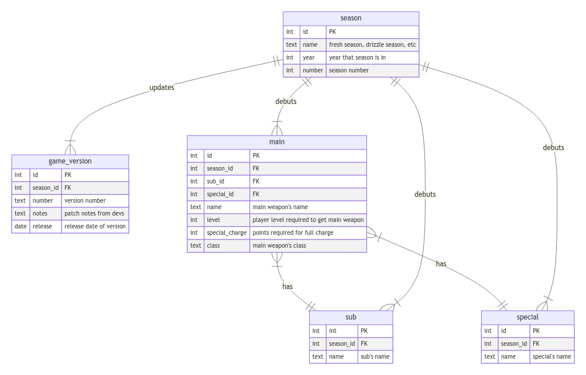

# SquidBase

## Scope

This SQlite database, SquidBase, contains weapon and version information for Splatoon 3. Currently weapon and version notes are scattered across the internet which makes it difficult to make any deeper analysis. This collect will help anyone interested in taking a more analytical look at weapon options and track how they've change via developer patch notes.

## Functional Requirements

## Representation

### Entities
* `season` contains data about the four in-game seasons (Sizzle, Chill, etc).
* `game_version` contains data about patch notes and release dates. 
* `main` contains data main weapons, weapon class, special charge limits, and foreign keys for sub weapons and specials.
* `sub` contains data about sub weapons.
* `special` contains data about specials.

### Relationships

`season` could be consider the highest level of the database as all other entities are related to by one-to-many relationships. These tables all have attribute `season_id` to relate either which season the item debuted in or which updates from `game_version` are occurred in each season.  
`main` is related to `sub` and `special` by one-to-many relationships with attributes `sub_id` and `special_id`, repsectively.

## Setup
Steps for setting up this database on your own machine.
* Download all files from repository.
* Create database file (.db)
* Use SQLite to run `schema.sql` followed by `process.sql`.
* `empty.sql` and `drop.sql` are used to clear the database in needed.

## Sources
[Nintendo Support Update History](https://en-americas-support.nintendo.com/app/answers/detail/a_id/61257/~/splatoon-3-update-history)  
[Inkepedia](https://splatoonwiki.org/wiki/Main_Page)  
[SQLite Homepage](https://www.sqlite.org/index.html)
